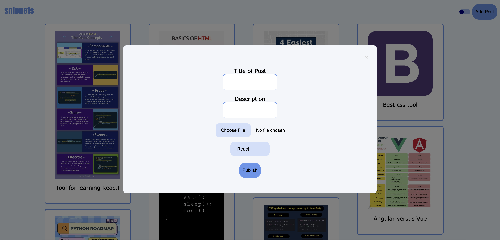

# snippets

A social media platform that allows users to share photos about code they've been working on or posts that helped them better understand a subject.

This application utilizes React, Node, and SQL databases. The dashboard consist of a feed that updates automatically every time a post is added. Plus, there is light and dark mode!

We welcome contributions as well. If you decide to contribute, please follow the rules below.

Rules:

1. All pull request need another person to be approved. 
2. All pull request need a clear explanation of what was added.
3. Add testing.
4. Open to new tech/ideas at any time!

IMPORTANT: Do not expose any private information. All keys and private information MUST be stored in the .env file.

